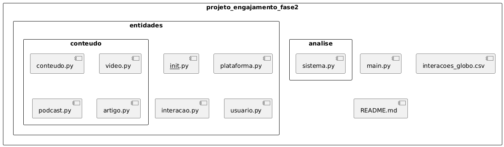
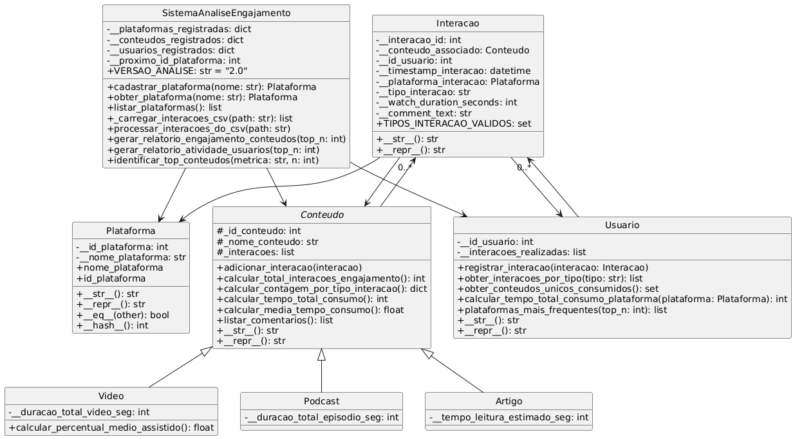

# 📊 Projeto Unificado - Fase 2: Análise de Engajamento de Mídias Globo com POO

Este repositório contém a implementação do projeto da Fase 2 do módulo **DS-PY-02 - Programação Orientada a Objetos em Python**, com foco na construção de um sistema robusto, modular e orientado a objetos para análise de engajamento em plataformas da Mídia Globo.

---

## 🎯 Objetivo

Aplicar os princípios e práticas de **Programação Orientada a Objetos (POO)** para modelar, processar e analisar interações de usuários com conteúdos em plataformas como G1 e Globoplay, com suporte a relatórios e métricas de engajamento.

---

## 🧱 Estrutura de Diretórios

```
projeto_engajamento_fase2/
├── main.py                         # Script principal de execução
├── interacoes_globo.csv           # Arquivo com dados brutos de interações
├── entidades/                     # Subpacote com entidades do domínio
│   ├── __init__.py
│   ├── plataforma.py              # Classe Plataforma
│   ├── conteudo.py                # Classes Conteudo, Video, Podcast, Artigo
│   ├── interacao.py               # Classe Interacao
│   ├── usuario.py                 # Classe Usuario
├── analise/                       # Subpacote com sistema de análise
│   ├── __init__.py
│   └── sistema.py                 # Classe SistemaAnaliseEngajamento
└── README.md
```



---

## 🧩 Principais Classes

- `Plataforma`: Representa plataformas de conteúdo como "G1" ou "Globoplay".
- `Conteudo` (abstrata) e subclasses: `Video`, `Podcast`, `Artigo`.
- `Interacao`: Representa ações dos usuários com conteúdos.
- `Usuario`: Agrega interações por usuário.
- `SistemaAnaliseEngajamento`: Classe de orquestração, leitura de dados e geração de relatórios.



---

## 🔍 Funcionalidades Implementadas

- Validação rigorosa dos dados na construção de objetos.
- Registro e agregação de interações.
- Cálculo de métricas como:
  - Total e tipo de interações.
  - Tempo médio de consumo.
  - Comentários associados.
- Relatórios de engajamento por conteúdo e por usuário.
- Identificação dos conteúdos mais populares por métrica.

---

## ▶️ Como Executar

1. Clone este repositório:

```bash
git clone https://github.com/seu-usuario/projeto_engajamento_fase2.git
cd projeto_engajamento_fase2
```

2. Execute o script principal:

```bash
python main.py
```

Certifique-se de que o arquivo `interacoes_globo.csv` esteja presente na raiz do projeto.

---

## 📘 Requisitos

- Python 3.8+
- Bibliotecas padrão (`datetime`, `csv`, etc.)

---

## 💡 Aprendizados Esperados

- Projeto orientado a objetos com encapsulamento, herança e polimorfismo.
- Organização modular com pacotes e subpacotes.
- Integração entre camadas de dados, lógica e apresentação.
- Práticas de validação de entrada e uso de `@property`.

---

## Equipe de colaboradores
| |  |    |  |  |  |
|:--:|:--:|:--:|:--:|:--:|:--:|
|<a href="https://github.com/EdOliveiraJr" target="_blank"> Edvaldo Oliveira</a> | <a href="https://github.com/malufazenda" target="_blank"> Malu Fazenda</a> | <a href="https://github.com/daniels070" target="_blank"> Daniel Brambila </a> | <a href="https://github.com/danilodpx" target="_blank"> Danilo Pinho </a> | <a href="https://github.com/LucasSandes07" target="_blank"> Lucas Sandes </a> | <a href="https://github.com/eufmartins" target="_blank"> Felipe Martins </a> |


## 📄 Licença

Este projeto é apenas para fins educacionais.
